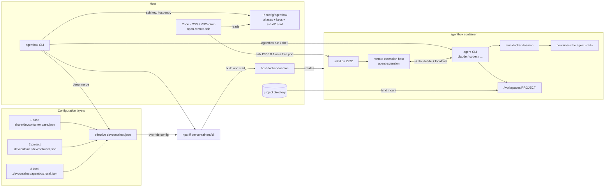

# agentbox

Run coding agents in a per-project dev container sandbox.

The agent gets a container with its own Docker daemon and nothing of the host but the project directory: no host Docker socket, no host home, no sibling repositories. One command per project, no per-project boilerplate.

Homepage: https://github.com/kevinveenbirkenbach/agentbox

## How it fits together



What the picture says:

- The agent only ever reaches `/workspaces/PROJECT`, which is the bind-mounted project directory. No host home, no sibling repositories.
- The container talks to its **own** Docker daemon. The host daemon is used once, by the CLI, to create the sandbox — the agent never gets a handle on it.
- The agent extension runs in the container, next to the agent CLI, because the two communicate over `~/.claude/ide` plus localhost. An extension host on the host side cannot reach either.
- The three configuration layers are merged on the host and handed to the devcontainer CLI as one file; nothing has to be edited by hand.

## Install

```bash
pipx install agentboxer
```

The distribution is named `agentboxer` because `agentbox` is taken on PyPI and `agentbox-cli` collides with an existing project once PyPI strips the separators; the command it installs is `agentbox`.

Independent of PyPI, from a checkout — this also installs what the host needs:

```bash
make install        # host dependencies plus agentbox
make host-deps      # host dependencies only
```

The package itself has no Python dependencies, but it drives host binaries and refuses to start without them:

| Binary | Used for |
|---|---|
| `docker` | building and running the sandbox |
| `npx` (Node.js) | fetching the [devcontainer CLI](https://github.com/devcontainers/cli) |
| `ssh-keygen` | the per-project key |
| `sysbox-runc` | nested Docker without `--privileged`, see below |

On Arch-based hosts `make host-deps` does the whole setup: it installs `docker`, `nodejs`, `npm` and `openssh` with pacman and `sysbox-ce-bin` with yay, enables both services, registers the sysbox runtime in `/etc/docker/daemon.json`, and restarts the Docker daemon so it picks the runtime up — which stops running containers, so it says so before doing it. Every step is skipped when it is already done, so re-running costs nothing. On other distributions it prints the list and leaves the machine alone.

## Quickstart

```bash
cd ~/Repositories/some-project
agentbox up
agentbox run claude
```

`agentbox up` builds and starts the sandbox, publishes its SSH port on a free `127.0.0.1` port, installs a per-project key, and writes an SSH host entry named after the project directory.

## Commands

| Command | What it does |
|---|---|
| `agentbox up [--rebuild]` | Build and start the sandbox for the current directory |
| `agentbox run <cmd…>` | Run a command inside the sandbox, e.g. `agentbox run claude` |
| `agentbox shell` | Open a shell inside the sandbox |
| `agentbox code [name]` | Open Code - OSS / VSCodium / VS Code on the sandbox |
| `agentbox down` | Remove the sandbox container |
| `agentbox init` | Write a project-owned `.devcontainer/devcontainer.json` and `post-create.sh`, plus `local` and `default` workspace files |

All commands accept `--workspace <dir>` and otherwise act on the current directory.

## One box per repository

Boxes run side by side and share nothing. Each project gets its own container, SSH port, key, host entry and agent home volume:

| Resource | Keyed by |
|---|---|
| Container | label `devcontainer.local_folder=<absolute path>` |
| SSH port | published by Docker on a free `127.0.0.1` port |
| Key, host entry | `~/.config/agentbox/keys/<alias>/`, `~/.config/agentbox/ssh.d/<alias>.conf` |
| Agent home (logins, history) | volume `agentbox-home-<alias>` |

The alias is the project directory name. Two repositories with the same directory name — `~/work/web` and `~/client/web` — would otherwise collide in all of the above, so the first one to claim `web` keeps it and the next gets a path digest appended: `web-0ac1b2`. Claims live in `~/.config/agentbox/aliases/` and are sticky, so an alias never changes under a running box.

Removing a box: `agentbox down`, plus `docker volume rm agentbox-home-<alias>` if its agent state should go too.

## Configuration layers

Later layers win; each is optional.

| Layer | File | Versioned |
|---|---|---|
| 1. agentbox default | `src/agentbox/share/devcontainer.base.json` | in this repo |
| 2. Project | `<project>/.devcontainer/devcontainer.json` | in the project |
| 3. Local override | `<project>/.devcontainer/agentbox.local.json` | no, gitignore it |

Layer 3 is deep-merged over whatever layer sits below it; dictionaries merge, lists and scalars are replaced. The merged result is handed to the devcontainer CLI via `--override-config`, so nothing needs to be edited by hand.

Example — this project needs Codex instead of Claude and a Python toolchain, but only on this machine:

```json
{
  "containerEnv": { "AGENTBOX_AGENTS": "@openai/codex" },
  "features": { "ghcr.io/devcontainers/features/python:1": {} }
}
```

Agents are npm packages listed in `AGENTBOX_AGENTS`, installed on first start. Skill collections are git repositories listed in `AGENTBOX_SKILLS`, installed alongside them — see [Skills](#skills).

## Reading a neighbouring repository

A window serves exactly one box, so folders from two boxes cannot share one window (see [Editor](#editor)). What works is the other direction: mount the neighbour into the box, read-only.

```json
{
  "mounts": [
    "source=${localWorkspaceFolder}/../other-repo,target=/workspaces/other-repo,type=bind,readonly"
  ]
}
```

That goes into `.devcontainer/agentbox.local.json`. `${localWorkspaceFolder}` is the devcontainer CLI's own variable, so the entry carries no machine-specific path and survives being committed. agentbox appends its own mounts — the home volume and the `/agentbox` share — after the merge, so an override that sets `mounts` no longer drops them.

A workspace file next to it reaches both, on the host and in the box, because the mount target mirrors the layout the repositories already have on the host:

```json
{ "folders": [{ "path": "." }, { "path": "../other-repo" }] }
```

The first `agentbox up` after this asks for `--trust-config`: a bind mount decides what the box can reach on this host, and an agent with write access to the repository could add one.

Read-only is the point. The agent in this box reads the neighbour to understand it and cannot change it; the neighbour's own box stays the only place where its code is written.

## Editor

The agent extension must run inside the container, otherwise it cannot reach the agent CLI. That happens automatically once the editor window itself is remote.

1. `agentbox code` picks an editor — `codium`, then `code`, then `code-oss` — and makes sure it carries a resolver extension. Which one depends on the marketplace the editor speaks, and the binary name does not reveal that: on Arch, `/usr/bin/code` is a symlink to Code - OSS, which serves Open VSX. So agentbox simply tries both, `jeanp413.open-remote-ssh` and `ms-vscode-remote.remote-ssh`, and keeps the one the marketplace actually has. The Dev Containers extension is not needed and is unavailable on Open VSX.

   Finding only Code - OSS, or no editor at all, it stops and asks for VSCodium to be installed (`yay -S vscodium-bin`) rather than opening a window that cannot connect. It does not install packages itself: that needs root, and a password prompt in the middle of a run is worse than a clear message.

   It also links the VSCodium and Code - OSS user settings directories, so both editors read the same `settings.json` and only one has to be configured. Two directories that both already carry settings are left untouched, with a warning: merging them is the operator's call, not the tool's.
2. `agentbox up` puts its own include at the top of `~/.ssh/config`, creating the file with owner-only permissions if it does not exist:

   ```
   Include ~/.config/agentbox/ssh.d/*.conf
   ```

   The line goes first because OpenSSH keeps the first value it obtains for an option — below an existing `Host *` block, that block would win over the alias.

3. `agentbox code` opens the window and installs the extensions the box is missing. A remote window carries its own extension set, so anything installed on the host is inert in there. Which ones it installs:

   - `customizations.vscode.extensions` from the effective devcontainer config, if the project declares it — versioned in the repository, the same field every devcontainer client reads.
   - otherwise everything installed on the host, mirrored into the box.

   Already-installed extensions are skipped, and the rest go in one call rather than one editor launch each.

4. `agentbox code` opens a `*.code-workspace` file when the project has one, and the folder otherwise:

   | Call | In the project | Opened |
   |---|---|---|
   | `agentbox code` | `local.code-workspace` | that file |
   | `agentbox code` | only `default.code-workspace` | that file |
   | `agentbox code` | exactly one other `*.code-workspace` | that file |
   | `agentbox code` | none | the folder |
   | `agentbox code` | several, none of them local or default | the folder, with a warning |
   | `agentbox code custom` | `custom.code-workspace` exists | that file |
   | `agentbox code custom` | it does not | nothing, with the existing files listed |

   The suffix is optional: `custom` and `custom.code-workspace` mean the same. `agentbox init` seeds both files, each one only if it is missing, and gitignores every workspace file but the default (`*.code-workspace` plus `!default.code-workspace`):

   - `local.code-workspace` is where you work. Add folders to it, keep it out of the repository, break it without consequence — the same role `agentbox.local.json` plays for the container config.
   - `default.code-workspace` is the project's, versioned like `devcontainer.json`. It is what a fresh clone opens, and what you copy from when the local one goes wrong.

   Both start identical. Their single folder entry is the relative path `.`, which resolves against the directory of the workspace file and is therefore valid both on the host and in the box, where the repository lives under `/workspaces/<project>`. One file, no `vscode-remote://` URIs, no host and box variant to keep in sync.

5. Trust the folder when the editor asks. Until then it runs in Restricted Mode and keeps every extension inert, which looks exactly like a failed install.

6. One window serves one box. A `.code-workspace` whose folders point at two different aliases does not load half of it — the foreign authority is discarded and the path is looked up inside the connected container instead:

   ```
   Ignoring the error while validating workspace folder
   vscode-remote://ssh-remote%2Bother/workspaces/other
   - Error: ENOENT: no such file or directory, stat '/workspaces/other'
   ```

   Opened on the host rather than through `agentbox code`, such a file reaches neither box: `No window found with remote authority: ssh-remote+…`. To work across repositories, either put them in one box — run agentbox on the directory above them and let a workspace file pick the subset — or mount the neighbour read-only, see [Reading a neighbouring repository](#reading-a-neighbouring-repository).

Ports change on every rebuild; `agentbox up` rewrites the host entry each time, so the alias stays valid.

**Use VSCodium, not Code - OSS.** Code - OSS publishes no remote server build of its own, and the client installs the server under its own commit hash — a VSCodium server carries a different one, so the connection dies while installing it. Pointing `remote.SSH.serverDownloadUrlTemplate` at a VSCodium release does not help: Code - OSS supplies no `release` value, which yields a malformed URL, and no VSCodium build matches the commit anyway. VSCodium ships client and server from the same source, so the pair matches by construction; `agentbox code` therefore prefers `codium` and warns when only `code-oss` is available.

The proprietary VS Code build works too — Microsoft publishes matching servers — at the cost of not being open source.

## Projects that already have a devcontainer.json

`agentbox up` uses the project's own config unchanged, so it runs the project's own `postCreateCommand` and agentbox's share directory is not mounted. `agentbox init` therefore writes a copy of the install script next to the config, as `.devcontainer/post-create.sh`, and points `postCreateCommand` at it — agents and skills are installed from there, and the script is the project's to edit.

For a config agentbox did not write, add the feature in this repository instead. It installs the agents; skills are not part of it, because they land in the home volume and a feature runs before that volume exists:

```json
"features": { "ghcr.io/kevinveenbirkenbach/agentbox/agentbox:0": { "agents": "@anthropic-ai/claude-code" } }
```

The feature source lives in `features/agentbox/`; publish it with `devcontainer features publish`.

## What the sandbox protects against

A misbehaving agent, reliably. A hostile one, only in part — the difference matters, so here is the honest split.

**Agent permissions belong in the box, not in the repository.** On first start `agentbox up` writes `~/.claude/settings.json` inside the container: everything allowed, `git commit` and `git push` denied. The file lives in the box's home volume, invisible to the host and separate per project. The permissions are merged in beside whatever `postCreateCommand` already put there — skill collections write their plugins and hooks into the same file — and a file that already carries a `permissions` block is left exactly as it is. A second, weaker guard inside a container that is already the boundary buys nothing and only costs prompts — which is exactly why the seeding is skipped, with a message, when a project declares nested Docker and the box therefore runs privileged. A privileged box is no boundary, so its agent does not get free rein.

Keeping this out of the repository's own `.claude/settings.json` matters: that file is read by agents running on the *host* too, where no container protects anything.

**Held:** the agent reaches the project directory and nothing else of the host. No host home, no sibling repositories, no host Docker socket, no SSH keys, no cloud credentials. `rm -rf` in there costs you the repository, not the machine.

**Not held, and unfixable by construction:** the agent writes files that *you* later execute on the host — `.git/hooks/*` on your next commit, the `Makefile` on your next `make`, `.vscode/tasks.json` when you open the folder locally. Read diffs before running anything, and remember that `.git/hooks` never shows up in one.

**Guarded, because agentbox opened it itself:** a devcontainer configuration decides what the next container may reach, and it lives in the repository the agent can write. `initializeCommand` even runs on the *host*. The project configuration is therefore checked against a **whitelist** of settings that cannot widen the box — image, features, ports, environment, editor customizations, the in-container lifecycle commands. Everything else stops `agentbox up` until you have read it: `runArgs`, `mounts`, `initializeCommand`, `workspaceMount`, `dockerComposeFile`, `build`, and any key the spec grows in future. Nested-Docker features are flagged by name, because they are what forces `--privileged`.

```
✖ .devcontainer/devcontainer.json sets runArgs
  These decide what the container may reach on this host …
    agentbox up --trust-config
```

The approval records a hash of those layers in `~/.config/agentbox/trusted/<alias>`, outside the repository. Change the configuration and the approval lapses; an agent cannot re-grant it.

**Nested Docker costs the isolation, unless sysbox is installed.** The `docker-in-docker` feature requires `--privileged`, which hands the container every capability, disables AppArmor and exposes the host's block devices — escaping is then a `mount` command, no exploit needed. It is therefore not part of the default configuration; a project that needs Docker inside the box declares it:

```json
"features": { "ghcr.io/devcontainers/features/docker-in-docker:2": {} }
```

When [sysbox](https://github.com/nestybox/sysbox) is available as a Docker runtime, `agentbox up` puts the box on it automatically, which gives nested Docker **without** privileges and a user namespace of its own. Without sysbox it says so and proceeds privileged — the choice is yours, but it is not silent:

```bash
yay -S sysbox-ce-bin      # Arch, AUR
```

## Limitations

- Even unprivileged, a container shares the host kernel. It is a strong boundary against mistakes and a moderate one against intent — not a substitute for a virtual machine when running genuinely hostile code.
- Network access is not restricted, so anything readable inside the box can leave it — including the agent credentials stored there.
- The project directory is bind-mounted, so build artifacts inside it (`.venv/`, `node_modules/`) are shared with the host and can collide between host and container toolchains. Mount them as volumes in layer 3 if that bites.
- Containers started *inside* the sandbox run in its nested Docker daemon; their published ports are not reachable from the host.
- The agent CLIs themselves are proprietary; only the sandbox around them is open source.

## Other agents

`AGENTBOX_AGENTS` is a space separated list of npm packages installed on first start. Override it per project in `.devcontainer/agentbox.local.json`:

```json
{
  "containerEnv": {
    "AGENTBOX_AGENTS": "@anthropic-ai/claude-code @openai/codex @google/gemini-cli"
  }
}
```

Then `agentbox up --rebuild` and `agentbox run codex`. Agents that are not npm packages (pipx tools, plain binaries) have no install path yet. The Pi agent (`@oh-my-pi/pi-coding-agent`, binary `omp`) needs bun rather than node.

## Skills

Every box installs [kevinveenbirkenbach/skills](https://github.com/kevinveenbirkenbach/skills) on first start, into `~/.claude/skills` and `~/.agents/skills` inside the container. `AGENTBOX_SKILLS` is a space separated list of git repositories; each one is cloned at its default branch and handed to its own `scripts/install.sh` with `TARGET=$HOME`, so a collection decides for itself what installing means — that repository also enables the caveman and ponytail plugins and registers the autotune and dream reminder hooks in the box's `~/.claude/settings.json`.

Override it per project in `.devcontainer/agentbox.local.json` — a different collection, several of them, or none at all:

```json
{
  "containerEnv": {
    "AGENTBOX_SKILLS": ""
  }
}
```

The skills live in the box's home volume, so they survive `agentbox down` and are re-installed on the next `agentbox up --rebuild`. A repository that cannot be cloned or whose installer fails is reported and skipped: the box comes up without it rather than not at all.

Read what a collection contains before running an agent on it. Skills are instructions the agent follows, and the collection pins third-party sources of its own in `skills-lock.json` — inside the box they run with the box's full permissions.

## Local LLMs

The sandbox has its own network namespace, so an Ollama or LM Studio server running on the **host** is not reachable from inside by default. Punch one hole into `.devcontainer/agentbox.local.json`:

```json
{
  "runArgs": ["--add-host=host.docker.internal:host-gateway"],
  "containerEnv": {
    "OLLAMA_BASE_URL": "http://host.docker.internal:11434",
    "OLLAMA_HOST": "http://host.docker.internal:11434"
  }
}
```

What each agent does with that, verified in the e2e suite below:

| Agent | Ollama | LM Studio | Invocation |
|---|---|---|---|
| codex | yes | yes | `codex exec -c model_provider=x -c model_providers.x.base_url=<url>/v1 -c model_providers.x.wire_api=responses -c model_providers.x.requires_openai_auth=false -m <model>` |
| pi (`omp`) | yes | catalog discovery works | `omp --model ollama/<model>` with `OLLAMA_BASE_URL` set, or `omp --model lm-studio/<model>` |
| Claude Code | via proxy | via proxy | Anthropic protocol only — needs a translator (e.g. LiteLLM) behind `ANTHROPIC_BASE_URL` |

Three constraints found the hard way, each encoded in the e2e suite:

- codex accepts only `wire_api = "responses"`; the chat-completions wire was removed. Both servers implement that endpoint.
- `codex --oss` insists on a daemon at `localhost:11434` and ignores `OLLAMA_HOST`, so a remote endpoint needs an explicit provider.
- Agent CLIs need a model that supports tool calling. `smollm2:135m` answers plain chat requests but fails every agent.

## Tests

Everything at once — unit tests plus the end-to-end suite:

```bash
make test
```

Unit tests alone, no containers:

```bash
make test-unit
```

End-to-end against real local LLMs, fully isolated in compose — Ollama, LM Studio in headless server mode, and a runner carrying codex and pi. No host network, no API keys, no accounts:

```bash
make test-e2e                  # tears the stack down afterwards
bash tests/e2e/run.sh --keep   # leaves it up for debugging
```

Models are pulled once into named volumes: `qwen2.5:0.5b` for Ollama, and for LM Studio the Hugging Face repository pinned in `tests/e2e/.env` — its CLI resolves search terms only against staff picks, so the source is a full URL rather than a name. Twelve checks then assert reachability, the native and OpenAI-compatible endpoints, and that codex and pi actually answer from a local model.

The runner shares the LM Studio container's network namespace, so LM Studio sits on `localhost:1234` exactly as the agent CLIs expect while Ollama stays reachable by service name.

Everything runs in CI on every push and pull request, and again before a release.

## License

MIT — see [LICENSE](LICENSE).

## Author

Kevin Veen-Birkenbach <kevin@veen.world>
