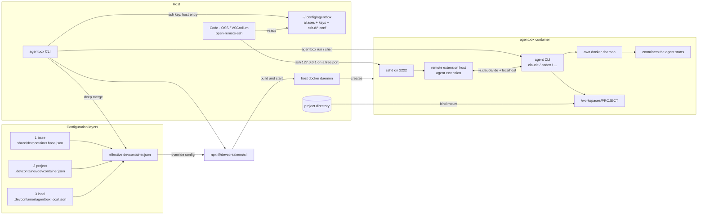

# agentbox

Run coding agents in a per-project dev container sandbox.

The agent gets a container with its own Docker daemon and nothing of the host but the project directory: no host Docker socket, no host home, no sibling repositories. One command per project, no per-project boilerplate.

Homepage: https://github.com/kevinveenbirkenbach/agentbox

## How it fits together



What the picture says:

- The agent only ever reaches `/workspaces/PROJECT`, which is the bind-mounted project directory. No host home, no sibling repositories.
- The container talks to its **own** Docker daemon. The host daemon is used once, by the CLI, to create the sandbox — the agent never gets a handle on it.
- The agent extension runs in the container, next to the agent CLI, because the two communicate over `~/.claude/ide` plus localhost. An extension host on the host side cannot reach either.
- The three configuration layers are merged on the host and handed to the devcontainer CLI as one file; nothing has to be edited by hand.

## Install

```bash
pipx install agentbox-cli
```

The distribution is named `agentbox-cli` because `agentbox` is taken on PyPI; the command it installs is `agentbox`.

Independent of PyPI, from a checkout:

```bash
make install
```

The package itself has no Python dependencies, but it drives three host binaries and refuses to start without them:

| Binary | Used for |
|---|---|
| `docker` | building and running the sandbox |
| `npx` (Node.js) | fetching the [devcontainer CLI](https://github.com/devcontainers/cli) |
| `ssh-keygen` | the per-project key |

## Quickstart

```bash
cd ~/Repositories/some-project
agentbox up
agentbox run claude
```

`agentbox up` builds and starts the sandbox, publishes its SSH port on a free `127.0.0.1` port, installs a per-project key, and writes an SSH host entry named after the project directory.

## Commands

| Command | What it does |
|---|---|
| `agentbox up [--rebuild]` | Build and start the sandbox for the current directory |
| `agentbox run <cmd…>` | Run a command inside the sandbox, e.g. `agentbox run claude` |
| `agentbox shell` | Open a shell inside the sandbox |
| `agentbox code` | Open Code - OSS / VSCodium / VS Code on the sandbox |
| `agentbox down` | Remove the sandbox container |
| `agentbox init` | Write a project-owned `.devcontainer/devcontainer.json` |

All commands accept `--workspace <dir>` and otherwise act on the current directory.

## One box per repository

Boxes run side by side and share nothing. Each project gets its own container, SSH port, key, host entry and agent home volume:

| Resource | Keyed by |
|---|---|
| Container | label `devcontainer.local_folder=<absolute path>` |
| SSH port | published by Docker on a free `127.0.0.1` port |
| Key, host entry | `~/.config/agentbox/keys/<alias>/`, `~/.config/agentbox/ssh.d/<alias>.conf` |
| Agent home (logins, history) | volume `agentbox-home-<alias>` |

The alias is the project directory name. Two repositories with the same directory name — `~/work/web` and `~/client/web` — would otherwise collide in all of the above, so the first one to claim `web` keeps it and the next gets a path digest appended: `web-0ac1b2`. Claims live in `~/.config/agentbox/aliases/` and are sticky, so an alias never changes under a running box.

Removing a box: `agentbox down`, plus `docker volume rm agentbox-home-<alias>` if its agent state should go too.

## Configuration layers

Later layers win; each is optional.

| Layer | File | Versioned |
|---|---|---|
| 1. agentbox default | `src/agentbox/share/devcontainer.base.json` | in this repo |
| 2. Project | `<project>/.devcontainer/devcontainer.json` | in the project |
| 3. Local override | `<project>/.devcontainer/agentbox.local.json` | no, gitignore it |

Layer 3 is deep-merged over whatever layer sits below it; dictionaries merge, lists and scalars are replaced. The merged result is handed to the devcontainer CLI via `--override-config`, so nothing needs to be edited by hand.

Example — this project needs Codex instead of Claude and a Python toolchain, but only on this machine:

```json
{
  "containerEnv": { "AGENTBOX_AGENTS": "@openai/codex" },
  "features": { "ghcr.io/devcontainers/features/python:1": {} }
}
```

Agents are npm packages listed in `AGENTBOX_AGENTS`, installed on first start.

## Editor

The agent extension must run inside the container, otherwise it cannot reach the agent CLI. That happens automatically once the editor window itself is remote.

1. Install `jeanp413.open-remote-ssh` from Open VSX (the proprietary Dev Containers extension is not needed and is unavailable on Open VSX).
2. Add this line once to `~/.ssh/config`:

   ```
   Include ~/.config/agentbox/ssh.d/*.conf
   ```

3. `agentbox code`, or connect manually to the host entry named after the project and open `/workspaces/<project>`.

Ports change on every rebuild; `agentbox up` rewrites the host entry each time, so the alias stays valid.

## Projects that already have a devcontainer.json

`agentbox up` uses the project's own config unchanged. To install the agents from there, add the feature in this repository:

```json
"features": { "ghcr.io/kevinveenbirkenbach/agentbox/agentbox:0": { "agents": "@anthropic-ai/claude-code" } }
```

The feature source lives in `features/agentbox/`; publish it with `devcontainer features publish`.

## Limitations

- The project directory is bind-mounted, so build artifacts inside it (`.venv/`, `node_modules/`) are shared with the host and can collide between host and container toolchains. Mount them as volumes in layer 3 if that bites.
- Containers started *inside* the sandbox run in its nested Docker daemon; their published ports are not reachable from the host.
- Network access is not restricted yet — the sandbox isolates the filesystem and the Docker daemon, not the internet.
- The agent CLIs themselves are proprietary; only the sandbox around them is open source.

## Other agents

`AGENTBOX_AGENTS` is a space separated list of npm packages installed on first start. Override it per project in `.devcontainer/agentbox.local.json`:

```json
{
  "containerEnv": {
    "AGENTBOX_AGENTS": "@anthropic-ai/claude-code @openai/codex @google/gemini-cli"
  }
}
```

Then `agentbox up --rebuild` and `agentbox run codex`. Agents that are not npm packages (pipx tools, plain binaries) have no install path yet. The Pi agent (`@oh-my-pi/pi-coding-agent`, binary `omp`) needs bun rather than node.

## Local LLMs

The sandbox has its own network namespace, so an Ollama or LM Studio server running on the **host** is not reachable from inside by default. Punch one hole into `.devcontainer/agentbox.local.json`:

```json
{
  "runArgs": ["--add-host=host.docker.internal:host-gateway"],
  "containerEnv": {
    "OLLAMA_BASE_URL": "http://host.docker.internal:11434",
    "OLLAMA_HOST": "http://host.docker.internal:11434"
  }
}
```

What each agent does with that, verified in the e2e suite below:

| Agent | Ollama | LM Studio | Invocation |
|---|---|---|---|
| codex | yes | yes | `codex exec -c model_provider=x -c model_providers.x.base_url=<url>/v1 -c model_providers.x.wire_api=responses -c model_providers.x.requires_openai_auth=false -m <model>` |
| pi (`omp`) | yes | catalog discovery works | `omp --model ollama/<model>` with `OLLAMA_BASE_URL` set, or `omp --model lm-studio/<model>` |
| Claude Code | via proxy | via proxy | Anthropic protocol only — needs a translator (e.g. LiteLLM) behind `ANTHROPIC_BASE_URL` |

Three constraints found the hard way, each encoded in the e2e suite:

- codex accepts only `wire_api = "responses"`; the chat-completions wire was removed. Both servers implement that endpoint.
- `codex --oss` insists on a daemon at `localhost:11434` and ignores `OLLAMA_HOST`, so a remote endpoint needs an explicit provider.
- Agent CLIs need a model that supports tool calling. `smollm2:135m` answers plain chat requests but fails every agent.

## Tests

Everything at once — unit tests plus the end-to-end suite:

```bash
make test
```

Unit tests alone, no containers:

```bash
make test-unit
```

End-to-end against real local LLMs, fully isolated in compose — Ollama, LM Studio in headless server mode, and a runner carrying codex and pi. No host network, no API keys, no accounts:

```bash
make test-e2e                  # tears the stack down afterwards
bash tests/e2e/run.sh --keep   # leaves it up for debugging
```

Models are pulled once into named volumes: `qwen2.5:0.5b` for Ollama, and for LM Studio the Hugging Face repository pinned in `tests/e2e/.env` — its CLI resolves search terms only against staff picks, so the source is a full URL rather than a name. Twelve checks then assert reachability, the native and OpenAI-compatible endpoints, and that codex and pi actually answer from a local model.

The runner shares the LM Studio container's network namespace, so LM Studio sits on `localhost:1234` exactly as the agent CLIs expect while Ollama stays reachable by service name.

Everything runs in CI on every push and pull request, and again before a release.

## License

MIT — see [LICENSE](LICENSE).

## Author

Kevin Veen-Birkenbach <kevin@veen.world>
